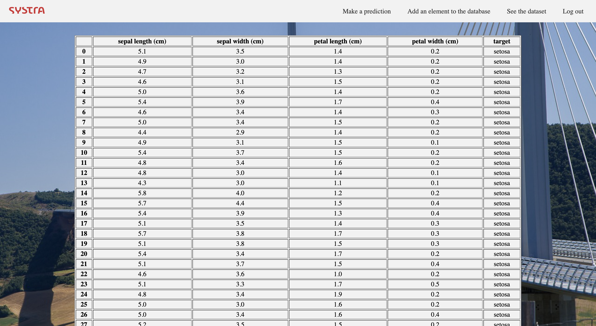
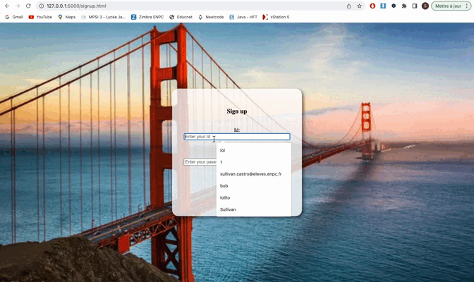

# AISystance
Mission Junior Entreprise : PEP x Systra

## Installation :construction_worker:

### Installation with pip

Make sure you have Python>=3.10.9.

```
pip install -r requirements.txt
```

### Installation with Anaconda

```
conda env create -f environment.yml
conda activate PEP
```

## Purposes :rocket:

There are several main usages you may be interested in:

1. Make predictions
2. Fetch the nearest neighbors 
3. Look up the dataset
4. Modify the database and fit the model

## How to use :man_technologist:

```
export FLASK_APP=project
export FLASK_DEBUG=1
flask run
```
### Homepage


### Sign up page


### Prediction page


### Database page



## Login system and privileges :unlock:

The login system works by privilege system, not all users have the same access:
-   Admin: they have access to all pages, from machine learning to database modification.
-   Data: they only have access to the database visualization but cannot make predictions or add new elements.

<p>
    
</p>

The navigation bars are not the same for both and the pages are protected preventing a malicious user from going through the URL to access the hidden content.

<p>
    
</p>

## Debug :bug:

1. If you see error :  
```
* Serving Flask app 'app'
* Debug mode: on
Address already in use
Port 5000 is in use by another program. Either identify and stop that program, or start the server with a different port.
```

You should launch the commands : 
```
lsof -i :5000
```
And kill the process.

For example for the message:
```
COMMAND     PID           USER   FD   TYPE             DEVICE SIZE/OFF NODE NAME
python3.1 76462 sullivancastro    4u  IPv4 0x5d2535ef8742ddc9      0t0  TCP localhost:commplex-main (LISTEN)
python3.1 76462 sullivancastro    6u  IPv4 0x5d2535ef8742ddc9      0t0  TCP localhost:commplex-main (LISTEN)
```

You should launch:
```
kill 76462
```
